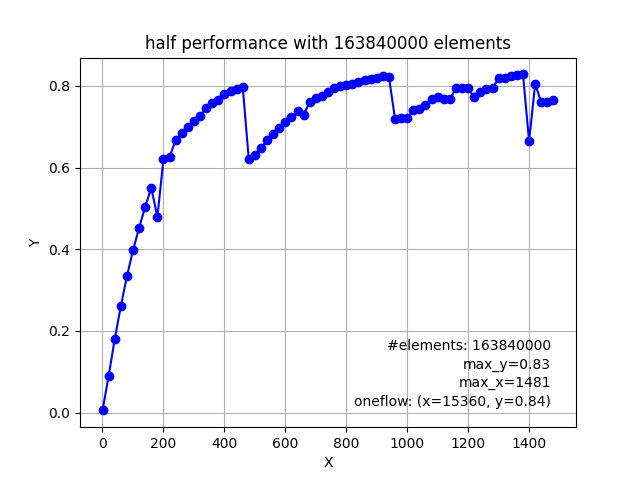
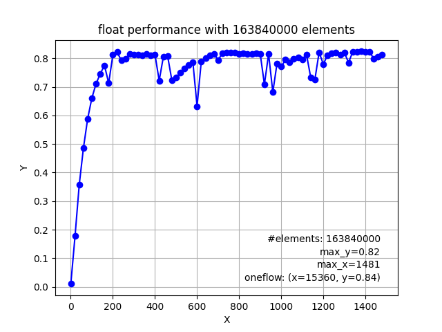
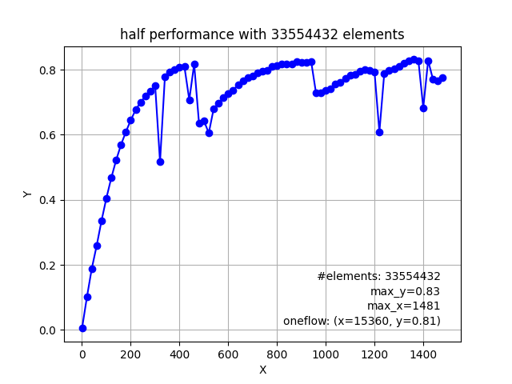
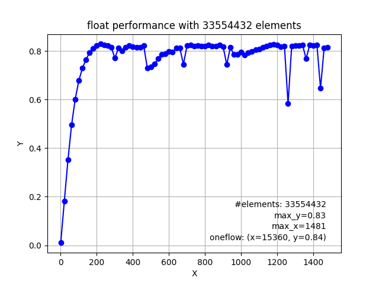
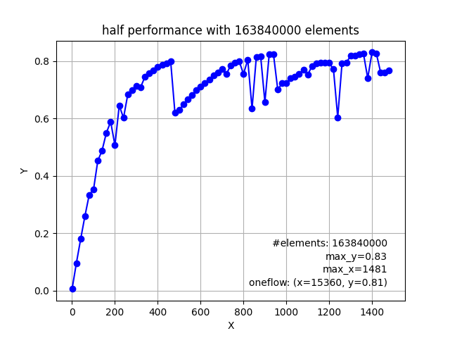
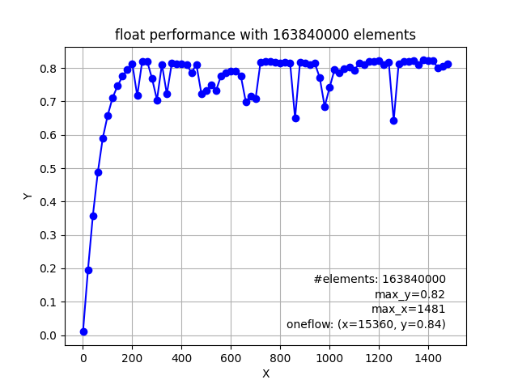
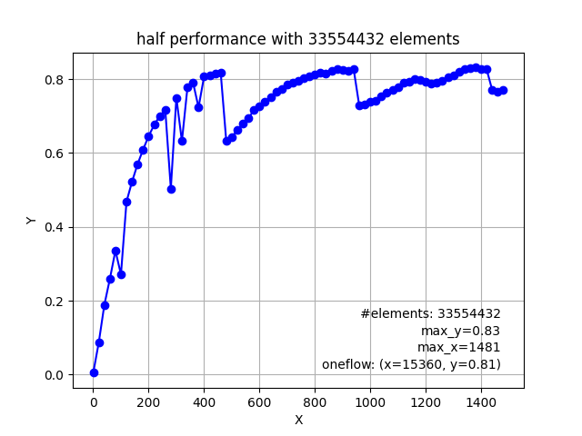
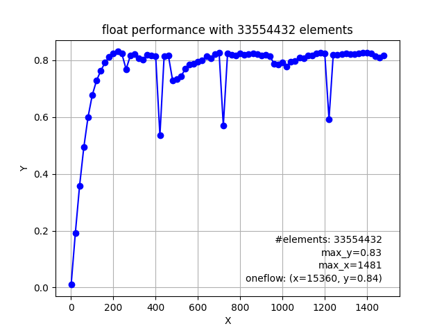

## Getting Started

### Test Env

* GPU: [RTX 3080Ti](https://www.techpowerup.com/gpu-specs/geforce-rtx-3080-ti.c3735)

* Cuda version: 11.4

* BandWidth: 912.4 GB/s

* detail info

  ```
  Device 0: "NVIDIA GeForce RTX 3080 Ti"
    CUDA Driver Version / Runtime Version          11.4 / 11.4
    CUDA Capability Major/Minor version number:    8.6
    Total amount of global memory:                 12045 MBytes (12630491136 bytes)
    (080) Multiprocessors, (128) CUDA Cores/MP:    10240 CUDA Cores
    GPU Max Clock rate:                            1755 MHz (1.75 GHz)
    Memory Clock rate:                             9501 Mhz
    Memory Bus Width:                              384-bit
    L2 Cache Size:                                 6291456 bytes
    Maximum Texture Dimension Size (x,y,z)         1D=(131072), 2D=(131072, 65536), 3D=(16384, 16384, 16384)
    Maximum Layered 1D Texture Size, (num) layers  1D=(32768), 2048 layers
    Maximum Layered 2D Texture Size, (num) layers  2D=(32768, 32768), 2048 layers
    Total amount of constant memory:               65536 bytes
    Total amount of shared memory per block:       49152 bytes
    Total shared memory per multiprocessor:        102400 bytes
    Total number of registers available per block: 65536
    Warp size:                                     32
    Maximum number of threads per multiprocessor:  1536
    Maximum number of threads per block:           1024
    Max dimension size of a thread block (x,y,z): (1024, 1024, 64)
    Max dimension size of a grid size    (x,y,z): (2147483647, 65535, 65535)
    Maximum memory pitch:                          2147483647 bytes
    Texture alignment:                             512 bytes
    Concurrent copy and kernel execution:          Yes with 2 copy engine(s)
    Run time limit on kernels:                     Yes
    Integrated GPU sharing Host Memory:            No
    Support host page-locked memory mapping:       Yes
    Alignment requirement for Surfaces:            Yes
    Device has ECC support:                        Disabled
    Device supports Unified Addressing (UVA):      Yes
    Device supports Managed Memory:                Yes
    Device supports Compute Preemption:            Yes
    Supports Cooperative Kernel Launch:            Yes
    Supports MultiDevice Co-op Kernel Launch:      Yes
    Device PCI Domain ID / Bus ID / location ID:   0 / 1 / 0
  ```


## Performance Tests

### elementwise addition

| #element=163840*1000 |                       Naive/Optimized                        | blocks/SM |
| :------------------: | :----------------------------------------------------------: | :-------: |
|       **Half**       |   |     6     |
|      **Float**       |  |     6     |


| #element=32\*1024*1024 |                       Naive/Optimized                       | blocks/SM |
| :--------------------: | :---------------------------------------------------------: | :-------: |
|        **Half**        |    |     -     |
|       **Float**        |  |     -     |


### elementwise multiplication

| #element=163840*1000 |                       Naive/Optimized                        | blocks/SM |
| :------------------: | :----------------------------------------------------------: | :-------: |
|       **Half**       |   |     6     |
|      **Float**       |  |     6     |


| #element=32\*1024*1024 |                       Naive/Optimized                       | blocks/SM |
| :--------------------: | :---------------------------------------------------------: | :-------: |
|        **Half**        |    |     -     |
|       **Float**        |  |     -     |


